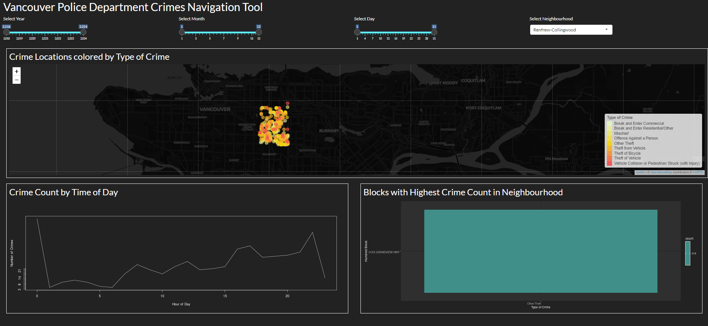

# Dashboard Name: Vancouver Police Department Crimes Navigation Tool

# Motivation

**Target audience:** This data visualization app is designed for law enforcement agencies, urban planners, researchers, and residents interested in exploring crime data in Vancouver.

Understanding patterns and trends in crime data is crucial for various stakeholders in Vancouver, including law enforcement agencies, urban planners, researchers, and concerned residents. By providing an interactive tool to navigate and analyze crime data, this dashboard aims to empower users with insights into crime incidents across neighborhoods, types of crimes, and temporal patterns. By understanding these patterns, stakeholders can make informed decisions to improve public safety, allocate resources effectively, and develop strategies for crime prevention

# App Description

The Vancouver Police Department Crimes Navigation Tool is a web-based application designed to provide users with interactive visualizations and analytics of crime data in Vancouver. Users can explore various aspects of crime incidents such as their distribution across neighborhoods, types of crimes, and temporal patterns. The app allows users to filter the data based on different criteria such as year, month, day, and neighborhood, providing a comprehensive view of crime trends in the city.

[Dashboard Video Walkthrough](https://drive.google.com/file/d/1m0Xf02C-yFpDuNxGZm94jBUWnQq9aLGL/view?usp=sharing)

Note: Video was large so could not add it to GitHub.

# Dataset 

The [dataset](https://geodash.vpd.ca/opendata/) used in the Vancouver Police Department Crimes Navigation Tool spans from 2018 to 2024 and is extracted from the PRIME BC Police Records Management System (RMS). The data undergoes specific filters, categorizations, and conditions to ensure its relevance to public safety and compliance with the BC Freedom of Information & Protection of Privacy Act (BC FIPPA). It includes a broad category of 'Offence Against a Person', encompassing various violent incidents while maintaining privacy by aggregating multiple subcategories. Property incidents offer a more granular breakdown, with categories such as 'Other Theft' covering diverse property-related offenses. The data primarily consists of 'Founded' incidents, indicating violations confirmed after police investigation. Users are cautioned against using the information to assess specific safety levels, as the data's aggregate nature may mask variations in subcategories. For further details, users are encouraged to refer to the Vancouver Police Department's [guidelines](https://geodash.vpd.ca/docs/VPD_GeoDASH_FAQs.pdf).

# Dashboard Interface 

Dashboard can be accessed: https://salvaumar.shinyapps.io/vanc_crime_stats_dashboard/
